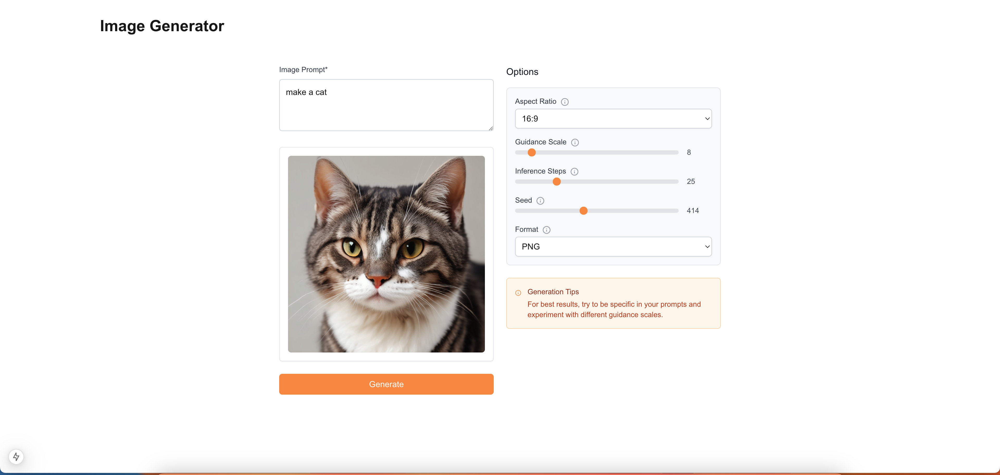

# Stable Diffusion 3.5 Self-Hosted Image Generation Demo



## Overview

This application provides an intuitive interface for AI image generation, offering customizable parameters. Built with performance and user experience in mind, it demonstrates modern web development practices using Next.js 14 and TypeScript.

## Key Features

- Advanced image generation using Stable Diffusion 3.5
- Customizable generation parameters
- Real-time generation status feedback
- Robust error handling and input validation
- Client-side image caching
- Automatic format optimization (JPEG/PNG)
- Responsive design for all devices

## Architecture

- Next.js 14 with App Router
- TypeScript for type safety
- Tailwind CSS for styling
- Custom React components
- Fireworks AI API integration
- Lucide React for iconography

## Getting Started

### Prerequisites

- Node.js 18.x or higher
- npm or yarn

### Installation

1. Clone the repository:
```bash
git clone https://github.com/BRama10/diffusion-demo.git
cd diffusion-demo
```

2. Install dependencies:
```bash
npm install
```

3. Configure environment variables:
```bash
# Create .env.local and add:
RUNPOD_API_KEY=your_api_key_here
RUNPOD_API_URL=your_api_endpoint_here
```

4. Start the development server:
```bash
npm run dev
```

The application will be available at `http://localhost:3000`.

## Configuration

### Generation Parameters

The application supports customization of:
- Image aspect ratio
- Guidance scale
- Number of inference steps
- Output format (JPEG/PNG)

## Documentation

Comprehensive documentation is available in the following sections:

- [Project Setup](./tutorial/setup.md)
- [Deployment Guide](./tutorial/deploy.md)
- [Backend Implementation](./tutorial/backend.md)
- [Component Architecture](./tutorial/component.md)
- [Frontend Development](./tutorial/frontend.md)


## Application Usage

1. Input Image Description
   - Enter a detailed prompt describing your desired image

2. Configure Parameters
   - Select aspect ratio
   - Adjust guidance scale
   - Set inference steps
   - Choose output format

3. Generate Image
   - Click "Generate" to initiate the process
   - Monitor real-time generation status
   - View the generated image upon completion

4. Post-Generation Options
   - Download the generated image
   - Regenerate with adjusted parameters
   - Share or save the results
