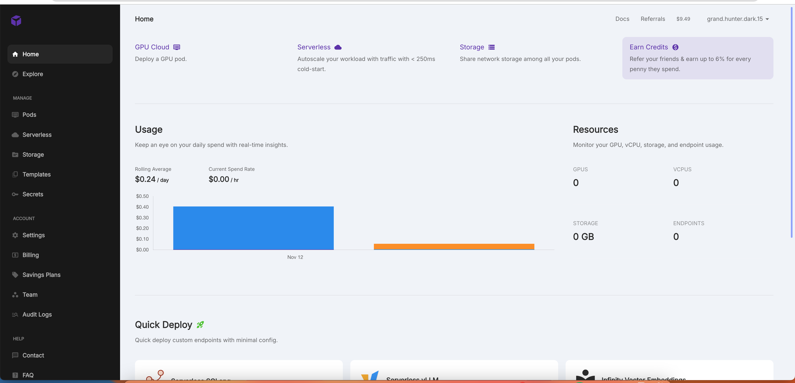
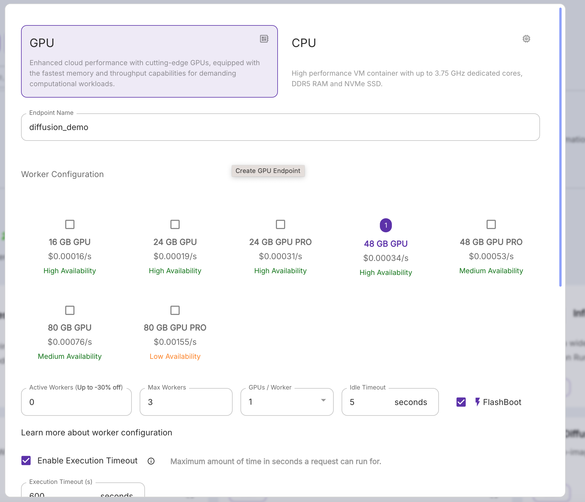
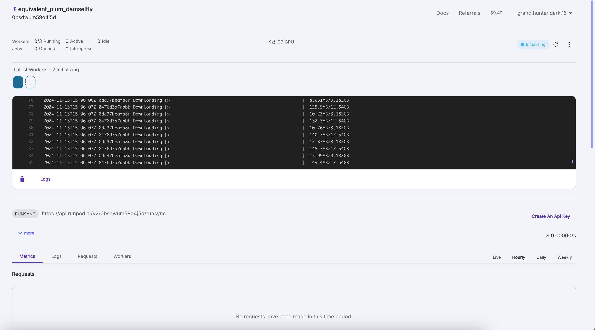
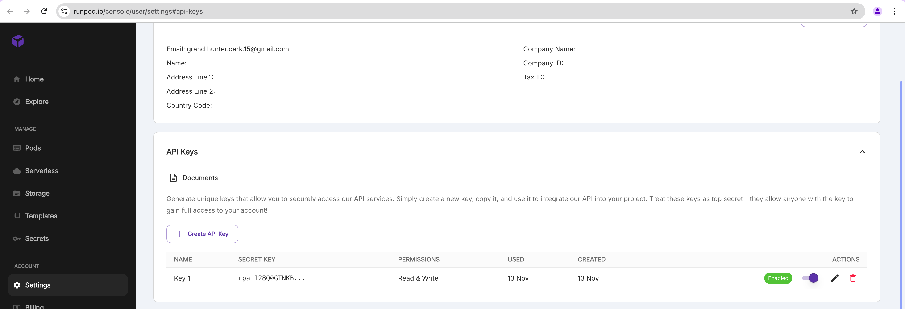

# Deploying Custom Model Endpoints on RunPod

## Introduction

RunPod offers a powerful serverless platform for deploying AI models and endpoints with GPU acceleration. This guide will walk you through the process of setting up and deploying serverless endpoints on RunPod.

## Understanding the Dashboard



The RunPod dashboard provides three main services:
1. **GPU Cloud**: Deploy individual GPU pods
2. **Serverless**: Autoscale your workload with traffic (< 250ms cold-start)
3. **Storage**: Share network storage among your pods

## Setting Up a Serverless Endpoint

### Step 1: Choose a Template

Select the Serverless tab.


RunPod offers several pre-configured templates for quick deployment:

1. **Serverless SGLang**: Fast-serving framework for large language models
2. **Serverless vLLM**: Deploy OpenAI-compatible Large Language Models
3. **Infinity Vector Embeddings**: Text embedding models
4. **Faster Whisper**: Fast speech-to-text using CTranslate2
5. **SD Automatic1111**: Stable Diffusion web interface
6. **Stable Diffusion XL**: Text-to-image generation at 1024×1024

However, for the newest model we need to use the custom container, so choose New Endpoint.

### Step 2: Configure GPU Endpoint


When creating a new endpoint, you'll need to:

1. Choose an endpoint name (e.g., "informal_green_firefly")
2. Select GPU configuration:
   - Either 24GB, 24BG Pro, or 48GB should work.

### Step 3: Worker Configuration



Configure your worker settings:

1. **Active Workers**: Set initial workers (0 for autoscaling)
2. **Max Workers**: Define scaling limit (e.g., 3)
3. **GPUs per Worker**: Allocate GPUs (typically 1)
4. **Idle Timeout**: Set worker shutdown time (e.g., 5 seconds)
5. **FlashBoot**: Enable for faster startup

### Step 4: Container Configuration


Final deployment settings:

1. **Select Template**: Choose from available templates
2. **Container Image**: Specify the Docker image (for example `thehunter911/stbldiff3.5-medium-runpod-serverless:dev`)

### Optional (not needed for here)

3. **Container Registry Credentials**: Add if needed 
4. **Container Start Command**: Custom startup commands
5. **Resources**:
   - Container Disk: Set storage (e.g., 5 GB)
   - HTTP Ports: Configure exposed ports
   - TCP Ports: Additional port configuration
6. **Environment Variables**: Add required env vars
7. **Advanced Settings**: Additional configurations

## Step 5: Deployment

Once configured, click the "Deploy" button to launch your endpoint. 

It might take a bit for the container to reach `Ready` status (top right).

# Deploying Serverless Endpoints on RunPod - A Complete Guide

## Step 6: Getting your API endpoint



After deployment, you can monitor your endpoint's status through the dashboard:

Next, get the Run Sync API url endpoint (https://api.runpod.ai/v2/0bsdwum59o4j5d/runsync in the image). Save it somewhere.


## Step 7: Setting Up API Access



### Creating an API Key
1. Navigate to Settings → API Keys
2. Click "Create API Key"
3. Your API keys will appear in the table with:
   - Name
   - Secret Key (hidden)
   - Permissions
   - Usage dates
   - Status
4. Make sure to copy your API key and store somewhere since you won't be able to see it again


### API Integration

Add the following variables to your `.env.local` and `.env` files using the example below

```bash
RUNPOD_API_KEY="rpa_I28Q0GTNKBXHgdsfgdsfgdsgdsg [should be the API key you created above]"
RUNPOD_API_URL="https://api.runpod.ai/v2/adfsfsafs/runsync [should be the endpoint you found above]"
```


## Best Practices

1. **Worker Configuration**:
   - Start with minimum active workers (0) for cost efficiency
   - Set reasonable max workers based on expected load
   - Enable FlashBoot for faster scaling

2. **Resource Management**:
   - Choose GPU size based on model requirements
   - Consider availability vs. cost tradeoffs
   - Monitor usage metrics for optimization

3. **Execution Settings**:
   - Set appropriate timeouts based on workload
   - Configure memory limits based on model size
   - Use environment variables for sensitive data

4. **Security**:
   - Never share your API keys
   - Rotate keys periodically
   - Use environment variables for key storage

5. **Usage**:
   - Monitor key usage regularly
   - Create separate keys for different projects
   - Disable unused keys

6. **Integration**:
   - Use the provided endpoint URL format
   - Include proper error handling
   - Implement request timeouts

## Cost Optimization

- Monitor the Rolling Average spend ($0.24/day in example)
- Use minimum required GPU size
- Leverage FlashBoot for faster cold starts
- Set appropriate idle timeouts
- Consider availability levels based on needs

---
← [Previous](./setup.md) | [Next](./backend.md)