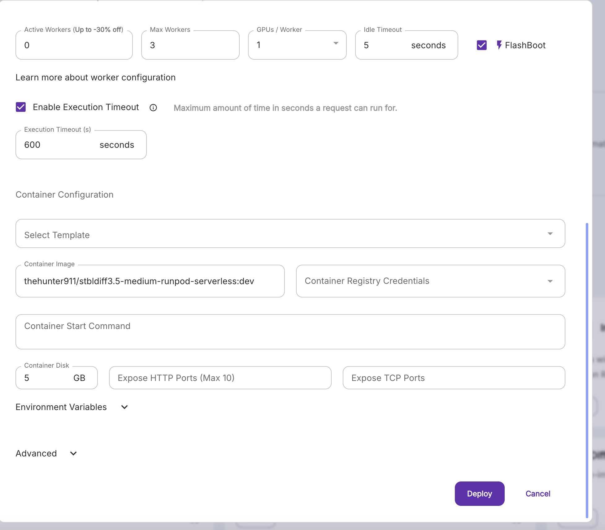

# Creating an On-Demand Deployment on Fireworks AI

This guide will walk you through creating your first deployment on Fireworks AI.

## Step 1: Create a Fireworks AI Account

1. Visit [fireworks.ai](https://fireworks.ai)
2. Click on "Sign Up" to create a new account
3. Complete the registration process
4. Login to your account

## Step 2: Navigate to Deployments

1. Go to [fireworks.ai/dashboard/deployments](https://fireworks.ai/dashboard/deployments)
2. You'll see the Getting Started page for deployments


_The deployments dashboard shows options for creating new deployments and exploring available models_

On this page, you can see:

- Instructions for deploying models
- Benefits of deployments like predictable performance and no rate limits
- Available models like Llama 3.1 (40B, 70B, and 8B versions)
- Option to create a new deployment via the "Get Started" button

## Step 3: Select a Base Model

Click "Get Started" to begin creating a new deployment.


_The model selection screen lets you choose your base model_

1. You'll see a 4-step process:

   - Model (current step)
   - Performance
   - Scaling
   - Metadata

2. In the Model selection screen:
   - Click the "Select base model" dropdown
   - Choose your desired model (One of the Diffusion ones)
   - You can also upload a custom model using the "Upload a custom model" link
   - Click "Continue" once you've made your selection

## Step 4: Configure Performance

After selecting your model, you'll configure performance settings.


_The performance configuration screen lets you set up GPU and optimization options_
_Use defaults for now since adding more increases price_

Key settings here include:

1. Accelerator Type

   - Choose between different GPU types (A100s vs H100s)
   - A100s are more affordable
   - H100s offer better latency and capacity

2. Accelerator Count

   - Set how many GPUs to use per replica
   - Default is 1 for most models
   - Increase for better performance or larger models

3. Long Prompts Option

   - Enable for prompts >3000 tokens
   - Requires minimum 2 GPUs
   - Improves performance for long inputs

4. PEFT Add-ons
   - Only enable if using fine-tuned models
   - Keep disabled unless specifically needed

## Step 5: Configure Scaling

After performance settings, you'll configure scaling options.


_The scaling configuration screen lets you set up auto-scaling parameters_
_Use defaults for now since adding more increases price_

Key settings include:

1. Auto-scaling

   - Check "Enable auto-scaling" to allow automatic scaling
   - Helps manage costs and performance

2. Min Replicas

   - Set minimum number of serving instances
   - Can be 0 for autoscale-to-zero
   - Setting 0 means you only pay when used

3. Max Replicas
   - Set maximum number of instances for scaling up
   - Each replica uses the configured GPU count
   - Example: max=3 means up to 3 replicas during high load
   - Set max=1 for now

## Step 6: Add Metadata

After configuring scaling options, you'll reach the final metadata configuration screen.


_The metadata screen lets you set the name and description for your deployment_

1. Set Display Name:

   - Enter a human-readable name for your deployment
   - Must be fewer than 64 characters
   - Example: "diffusion-demo"
   - This name will be used to identify your deployment

2. Add Description:

   - Provide more detailed information about your deployment
   - Example: "Diffusion Demo Deployment"
   - Helps track the purpose of different deployments

3. Click "Finish" to create your deployment

## Step 7: Monitor Deployment Creation

After clicking Finish, you'll be taken to the Deployments dashboard.


_The deployments dashboard shows your deployment being created_

Here you can see:

1. Your deployment listed (e.g., "diffusion-demo")
2. The creation status indicator ("Creating")
3. Deployment details including:
   - Base model information
   - Creation timestamp
   - Creator information

Key Features of the Dashboard:

- Search bar for finding specific deployments
- Status indicators for each deployment
- Detailed information about each deployment
- Options to manage existing deployments

### Deployment States

Your deployment will go through several states:

1. Creating (as shown in the screenshot)
2. Provisioning
3. Ready (when it's available for use)

Wait for the deployment to reach the "Ready" state before attempting to use it.

## Step 8: Connect model to backend

Click on the model.


_The model page shows information about your deployed model_

In the **Name** section, you'll see something like

```bash
accounts/grand-hunter-dark-15-e508c0/deployments/9780c165
```

In this, grand-hunter-dark-15-e508c0 is the ACCOUNT_ID and 9780c165 is the MODEL_ID.

In `app/api/generate/route.ts`, replace

```bash
https://api.fireworks.ai/inference/v1/workflows/accounts/fireworks/models/stable-diffusion-3p5-large-turbo/text_to_image'
```

with

```bash
https://api.fireworks.ai/inference/v1/workflows/accounts/<ACCOUNT_ID>/deployedModels/<MODEL_ID>/text_to_image
```

Now your app is connected to the new model!

---

_Note: The screenshots show the exact interfaces you'll encounter during deployment creation and management. Follow along with each screen as you create and manage your deployment._

← [Frontend](./frontend.md)